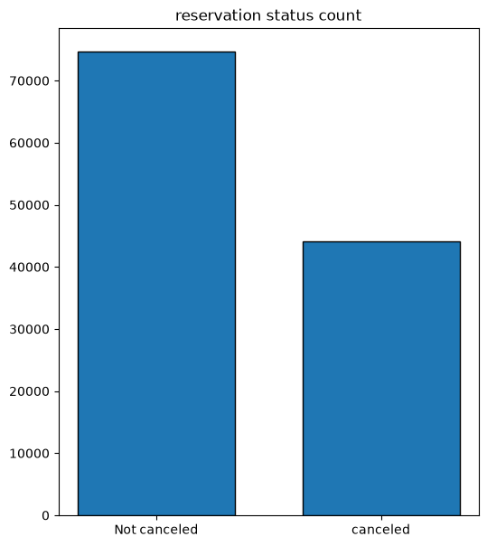

#  Hotel Booking Cancellation Analysis

##  Project Overview

This project analyzes hotel booking data to understand reservation
patterns, cancellation behavior, pricing trends, and differences
between City Hotels and Resort Hotels.

The analysis focuses on reservation status, Average Daily Rate (ADR),
monthly booking patterns, hotel type comparison, and country-wise
cancellation trends.

---

##  Business Objectives

1. Analyze overall reservation and cancellation patterns

2. Compare City Hotel and Resort Hotel reservations

3. Analyze monthly reservation trends

4. Study Average Daily Rate (ADR) trends

5. Compare ADR between cancelled and non-cancelled reservations

6. Identify countries with high cancellation volumes

7. Generate actionable business insights


---

##  Tools & Technologies

- Python
- Pandas
- NumPy
- Matplotlib
- Seaborn
- Jupyter Notebook
- Exploratory Data Analysis (EDA)

---

## 📊 Key Analysis

### 1. Reservation Status Analysis

The analysis compares cancelled and non-cancelled hotel reservations
to understand the overall cancellation pattern.



---

### 2. Reservation Status by Hotel Type

Reservation patterns are compared between City Hotels and Resort Hotels
to understand differences in booking and cancellation volumes.


---

### 3. Monthly Reservation Analysis

Monthly reservation status is analyzed to identify periods with higher
or lower cancellation volumes.


---

### 4. Average Daily Rate (ADR) Analysis

ADR trends are analyzed to understand pricing behavior over the
booking period.


---

### 5. ADR by Month

Monthly ADR is analyzed to identify changes in hotel pricing patterns.


---

### 6. City Hotel vs Resort Hotel ADR

The analysis compares Average Daily Rate between City Hotels and
Resort Hotels.


---

### 7. Country-wise Cancellation Analysis

The analysis identifies countries contributing to cancelled
reservations.


---

##  Key Insights

- The dataset contains a substantial number of cancelled reservations.
- City Hotels have a higher reservation volume than Resort Hotels.
- Cancellation volumes vary across different months.
- ADR varies across months and between City and Resort Hotels.
- Country-level analysis shows significant differences in cancellation
  volumes.

---

##  Business Recommendations

Based on the analysis, hotels can:

1. Monitor high-cancellation customer segments.
2. Analyze cancellation patterns by country and hotel type.
3. Use historical booking patterns for better demand forecasting.
4. Review pricing strategies during high-cancellation periods.
5. Develop appropriate cancellation and deposit policies.
6. Identify high-risk bookings using historical reservation behavior.

---

##  Project Structure

```text
hotel-booking-cancellation-analysis/
│
├── README.md
├── hotel_booking Analysis.ipynb
│
└── images/
    ├── ADR per month.png
    ├── Average daily in city or resort hotels.png
    ├── Average daily rate.png
    ├── Reservation status per months.png
    ├── Top 10 countries with reservation canceled.png
    ├── output.png
    └── reservatioin status in different hotels.png
